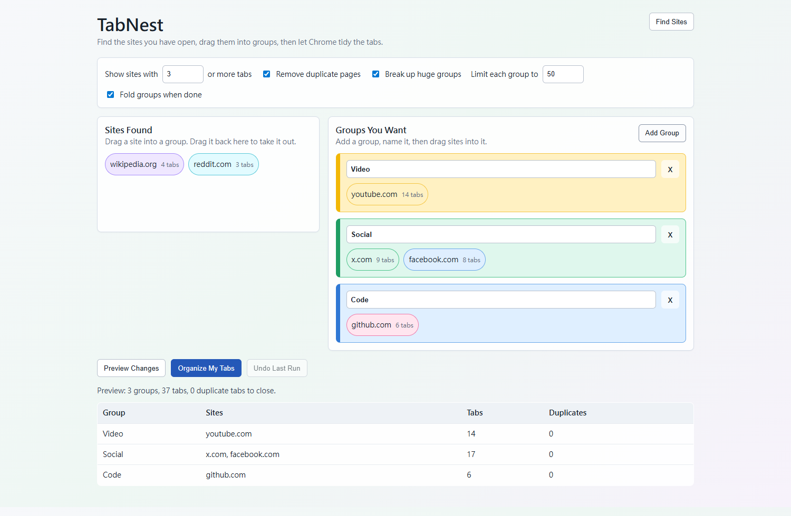

# TabNest

TabNest is a local Chrome extension that helps you clean up a crowded Chrome window.

It finds sites that have many open tabs, lets you drag those sites into groups you name yourself, then creates normal Chrome tab groups.

The preview image uses sample domains only.

## Why It Is Simple

- No account.
- No setup after installation.
- No network access.
- No analytics.
- No tab data leaves your browser.

## Features

- Finds busy sites automatically when you open the organizer.
- Lets you create your own group names.
- Lets you drag sites into the groups you want.
- Can close exact duplicate pages.
- Can split very large groups into smaller groups.
- Can fold groups after organizing.
- Supports English, Traditional Chinese, Japanese, German, Italian, and French.

## Install From GitHub

1. Download this repository as a ZIP.
2. Unzip it.
3. Open `chrome://extensions`.
4. Turn on **Developer mode**.
5. Click **Load unpacked**.
6. Select the unzipped folder that contains `manifest.json`.
7. The organizer opens automatically. You can also open it from the extension icon.

## How To Use

1. Open the organizer.
2. Click **Find Sites** if you want to refresh the scan.
3. Click **Add Group**.
4. Rename the group.
5. Drag sites from **Sites Found** into that group.
6. Click **Preview Changes**.
7. Click **Organize My Tabs**.

## Development

This is a Manifest V3 Chrome extension with no build step. Reload it from `chrome://extensions` after editing.

---

# TabNest

TabNest 可以幫你整理塞滿分頁的 Chrome 視窗。

它是一個本機 Chrome 擴充功能，會找出開很多分頁的網站，讓你把網站拖進自己命名的群組，最後建立一般的 Chrome 分頁群組。

上面的預覽圖只使用範例網站，不是任何人的真實分頁。

## 為什麼簡單

- 不用帳號。
- 安裝後不用設定。
- 不需要網路。
- 沒有分析追蹤。
- 分頁資料不會離開你的瀏覽器。

## 功能

- 打開整理器時自動找出分頁數較多的網站。
- 可自己建立群組名稱。
- 可把網站拖進你想要的群組。
- 可關掉完全相同的重複頁面。
- 可把太大的群組拆成較小群組。
- 可在整理後先收合群組。
- 支援英文、繁體中文、日文、德文、義大利文、法文。

## 從 GitHub 安裝

1. 下載這個 repository 的 ZIP。
2. 解壓縮。
3. 打開 `chrome://extensions`。
4. 開啟「開發人員模式」。
5. 點「載入未封裝項目」。
6. 選擇解壓縮後、包含 `manifest.json` 的資料夾。
7. 整理器會自動打開，也可以從擴充功能圖示開啟。

## 使用方式

1. 打開整理器。
2. 如果要重新整理掃描結果，按「開始掃描」。
3. 按「新增群組」。
4. 替群組命名。
5. 把「掃描到的網站」拖進群組。
6. 按「先看結果」。
7. 按「開始整理」。

## 開發

這是 Manifest V3 Chrome 擴充功能，沒有 build step。修改後到 `chrome://extensions` 重新載入即可。
